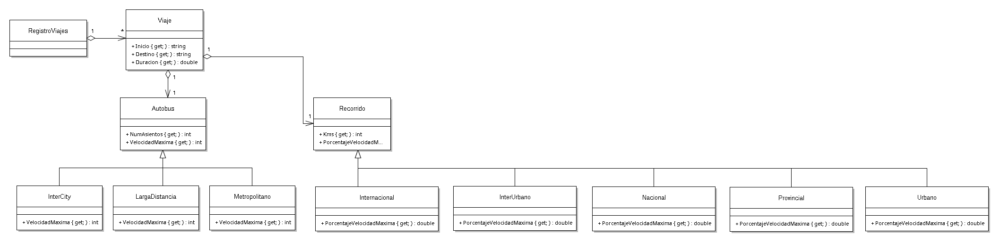

# AvVisualViajes

## Introducción

La aplicación de gestión de viajes utilizando Avalonia para la interfaz gráfica de usuario, aunque también proporciona un CLI.

El programa puede ejecutarse tal cual, con lo que se invoca la CLI (interfaz de consola), o bien puede utilizarse el parámetro `--gui`, que hará que se invoque la interfaz gráfica.

## Diseño

El objetivo de la aplicación es preparar viajes que dependen de un tipo de recorrido y también un tipo de autobuses. Los diferentes autobuses proporcionan una velocidad máxima distinta, mientras que los diferentes recorridos especifican un porcentaje real de uso de la velocidad máxima. Con estos datos, más el kilometraje, es posible predecir el tiempo de llegada.

## Compilación y ejecución

La aplicación está preparada para ser abierta desde Rider, si bien funcionará también abriéndola desde Visual Studio.

Desde el CLI, es posible simplemente ejecutarla con `dotnet run`, o bien `dotnet run --gui` para la interfaz gráfica.